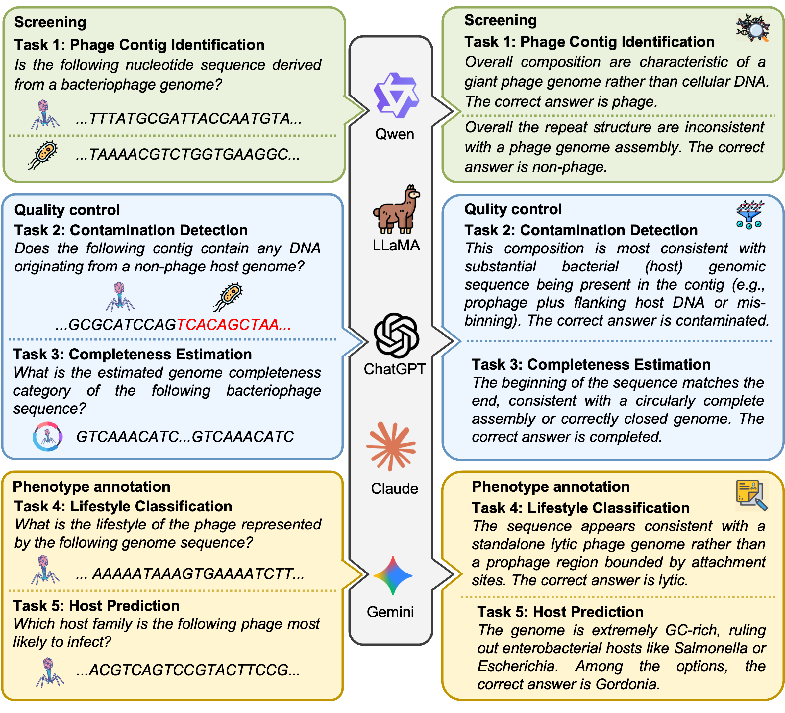
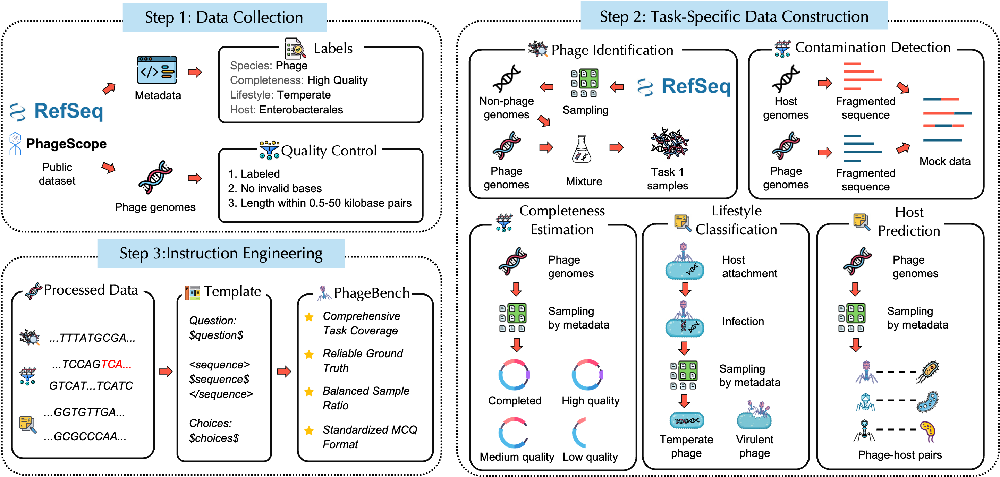
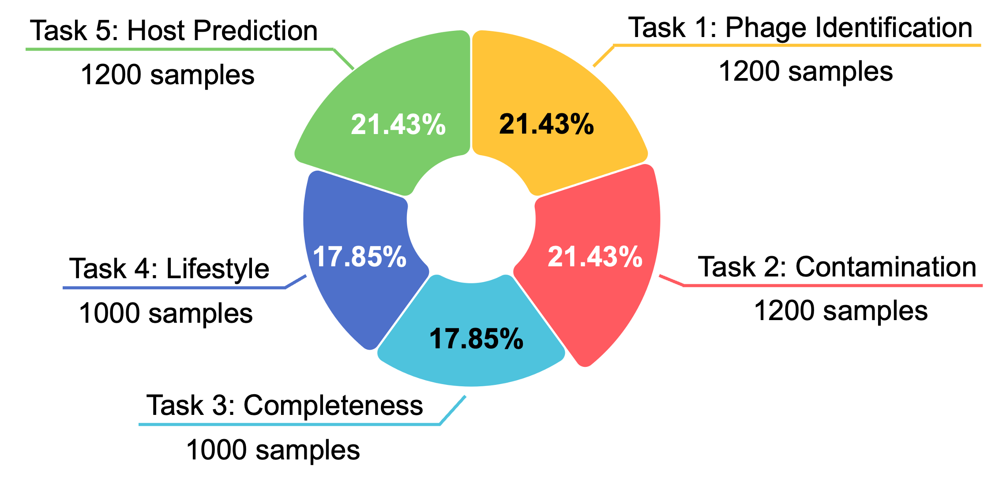

#  PhageBench: Can LLMs Understand Raw Bacteriophage Genomes?

### **🎉🎉🎉 PhageBench was accepted to ACL 2026 Findings! 🤖 meets 🦠!**

<code>All The World's A Phage.</code>

**PhageBench** confronts general-purpose Large Language Models (LLMs) with a fundamental question: **Can models trained on natural language understand the language of life?**


The intersection of AI and biology is shifting from text analysis to direct genomic decoding. While specialized Genomic Foundation Models (GFMs) require massive pre-training on DNA, PhageBench investigates whether general-purpose LLMs can leverage their inherent reasoning capabilities to interpret raw genomes zero-shot.

We propose **bacteriophages** as the ideal testbed for this challenge:
*   **Perfect Scale**: Phage genomes (typically 3–150kb) align well with the context windows of modern LLMs.
*   **Linguistic Structure**: Unlike complex eukaryotic genomes, phages exhibit a dense, linear syntax similar to natural language, enabling reasoning-based functional prediction.
*   **Scientific Impact**: As the "dark matter" of the biosphere, accurate phage annotation is critical for scientific discovery, food engineering, and therapeutic applications. 

<div style="text-align: center;">
  
</div>

PhageBench contains **5,600 high-quality samples** covering **five core tasks** across three stages:
1.  **Screening**: Phage Contig Identification (distinguishing phages from environmental noise like bacteria, plasmids, etc.).
2.  **Quality Control**: Contamination Detection (identifying host signals) and Completeness Estimation (assessing genome integrity).
3.  **Phenotype Annotation**: Lifestyle Classification (Virulent vs. Temperate) and Host Prediction (identifying host ranges).

<div style="text-align: center;">
  
</div>

PhageBench ensures rigorous evaluation with:
*   **Realistic Lengths**: Sequences ranging from 0.5kb to 50kb.
*   **Standardized Format**: Challenge LLMs with standardized multiple-choice questions to ensure reliable parsing and evaluation.
*   **Diverse Sources**: High-confidence data derived from authoritative databases (RefSeq, PhageScope).

<div style="text-align: center;">
  
</div>

## 🧪 How to evaluate on PhageBench

### Install 
1. Create and activate the conda environment:
```bash
conda create -n phage-bench python=3.12
conda activate phage-bench
```

2. Install the requirements with pip: 
```bash
pip install -r requirements.txt
```

### Load Data
The benchmark data is located in the `data` folder, containing 5 JSON files corresponding to the 5 tasks (`task1.json` to `task5.json`).

### Data Format

All data in **PhageBench** are standardized to the following format:

```json
{
      "id": "Unique task id for each sample.",
      "task": "The type of task for this sample.",
      "question": "The input instruction for this sample, which is task-specific.",
      "sequence": "This is the raw DNA sequence required for this task.",
      "choices": "Options for this sample.\n",
      "answer": "The ground truth answer for this sample, such as A, B, C, or D.",
      "metadata": {
          "task_ctg_len": "The length of DNA sequence for this sample.",
          "task_ctg_gc_content": "The GC content of DNA sequence for this sample.",
          "task_ctg_is_chunked": "Whether the DNA sequence is chunked.",
          "task_ctg_species": "The species/class of the input sequence, such as phages, plasmids, etc.",
          "seq_id": "The accession code of the input sequence.",
          "seq_from": "The source of the input sequence.",
          "completeness": "The completeness of the input sequence.",
          # other task specific metadata 
      }
  }
```

### Evaluation

To run model evaluation, first add your model path and its context window length to `config/`. Please ensure the context length of your model is enough to handle the longest DNA sequence in **PhageBench**, which is 50kb.

#### Step 1: Set API key
Please modify `.env.example` to `.env` and set your API key and base URL.

#### Step 2: Run Model Inference

Run the model inference using `pred.py`. You must specify the model and the task.

```bash
python pred.py --model gpt-4o-mini --task task1
```

**Arguments:**
- `--model`: Model name (must be defined in `config/model2path.json` or use `gpt`/`claude` prefixes for API models).
- `--task`: The task to evaluate (`task1`, `task2`, `task3`, `task4`, `task5`).
- `--cot`: Enable evaluation under the Chain-of-Thought (CoT) setting (using "Think step-by-step" prompt).
- `--n_proc`: Number of parallel processes (default: 16).
- `--num_samples`: Number of samples to run (default: 1, set to -1 or large number to run all).

Example with CoT:
```bash
python pred.py --model gpt-opc-120b --task task1 --cot
```

Alternatively, use the provided shell scripts for batch inference:
```bash
bash run_0shot_cot.sh
bash run_cot_thinking.sh
```

#### Step 3: Export Results
You can use `extract_eval_result.py` to summarize the results:
```bash
python extract_eval_result.py
```

## Results
Model performance accuracy (%) on PhageBench tasks under zero shot CoT setting. **Bolded**: the best performance. <u>Underlined</u>: the second performance. Avg.: the average across all tasks. T: task.

<table>
<thead>
  <tr>
    <th rowspan="2">Model</th>
    <th>T1: Phage</th>
    <th>T2:</th>
    <th>T3:</th>
    <th>T4:</th>
    <th>T5: Host</th>
    <th rowspan="2">Avg.</th>
  </tr>
  <tr>
    <th>Identification</th>
    <th>Contamination</th>
    <th>Completeness</th>
    <th>Lifestyle</th>
    <th>Prediction</th>
  </tr>
</thead>
<tbody>
  <tr>
    <td colspan="7" align="center" style="background-color: #f0f0f0;"><strong><em>Non-reasoning</em></strong></td>
  </tr>
  <tr>
    <td>GPT-4o-mini</td>
    <td align="center">50.00</td>
    <td align="center">50.08</td>
    <td align="center">24.50</td>
    <td align="center">48.40</td>
    <td align="center">27.75</td>
    <td align="center">40.15</td>
  </tr>
  <tr>
    <td>LLaMA 4</td>
    <td align="center">53.25</td>
    <td align="center">49.58</td>
    <td align="center">27.10</td>
    <td align="center"><u>54.50</u></td>
    <td align="center">28.58</td>
    <td align="center">42.60</td>
  </tr>
  <tr>
    <td>Qwen3-235b</td>
    <td align="center">51.58</td>
    <td align="center">49.33</td>
    <td align="center">25.40</td>
    <td align="center">52.00</td>
    <td align="center">28.58</td>
    <td align="center">41.38</td>
  </tr>
  <tr>
    <td colspan="7" align="center" style="background-color: #f0f0f0;"><strong><em>Reasoning</em></strong></td>
  </tr>
  <tr>
    <td>GPT-OSS-120b</td>
    <td align="center">50.08</td>
    <td align="center">46.58</td>
    <td align="center">24.20</td>
    <td align="center">49.50</td>
    <td align="center">41.00</td>
    <td align="center">42.27</td>
  </tr>
  <tr>
    <td>GPT-5.2</td>
    <td align="center"><u>70.75</u></td>
    <td align="center"><u>54.17</u></td>
    <td align="center"><strong>43.10</strong></td>
    <td align="center">51.50</td>
    <td align="center">35.25</td>
    <td align="center"><u>50.95</u></td>
  </tr>
  <tr>
    <td>Gemini-3-flash</td>
    <td align="center"><strong>70.83</strong></td>
    <td align="center"><strong>58.83</strong></td>
    <td align="center">32.10</td>
    <td align="center"><strong>57.40</strong></td>
    <td align="center"><strong>62.50</strong></td>
    <td align="center"><strong>56.33</strong></td>
  </tr>
  <tr>
    <td>Claude-sonnet-4.5</td>
    <td align="center">57.92</td>
    <td align="center">51.83</td>
    <td align="center"><u>35.50</u></td>
    <td align="center">50.00</td>
    <td align="center"><u>44.17</u></td>
    <td align="center">47.88</td>
  </tr>
  <tr>
    <td>Qwen3-max</td>
    <td align="center">57.42</td>
    <td align="center">52.58</td>
    <td align="center">33.80</td>
    <td align="center">49.90</td>
    <td align="center">34.75</td>
    <td align="center">45.69</td>
  </tr>
  <tr>
    <td colspan="7" align="center" style="background-color: #f0f0f0;"><strong><em>Baseline</em></strong></td>
  </tr>
  <tr>
    <td>Random</td>
    <td align="center">50.00</td>
    <td align="center">50.00</td>
    <td align="center">25.00</td>
    <td align="center">50.00</td>
    <td align="center">25.00</td>
    <td align="center">40.00</td>
  </tr>
   <tr>
    <td colspan="7" style="border-top: 2px solid black;"></td>
  </tr>
</tbody>
</table>

## Project Structure

```bash
phage-bench/
├── config/
│   ├── model2path.json
│   └── model2maxlen.json
├── data/
│   ├── task1.json
│   ├── task2.json
│   ├── task3.json
│   ├── task4.json
│   └── task5.json
├── misc/
│   ├── bacteriophage.png
│   ├── fig1_.png
│   ├── fig2_.png
│   └── fig3_data_overall.png
├── prompts/
│   ├── 0shot_cot.txt
│   └── 0shot.txt
├── .env.example
├── extract_eval_result.py
├── pred.py
├── README.md
├── requirements.txt
├── run_0shot_cot.sh
└── run_cot_thinking.sh
